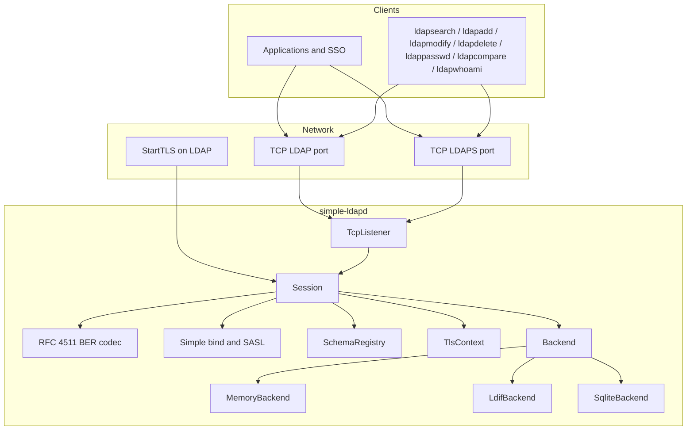

# Architecture

simple-ldapd is a single-process LDAPv3 server. One accept thread polls LDAP and LDAPS and starts a session thread per connection. It is not a cluster.



## Components

| Piece | Role |
|-------|------|
| `LdapDaemon` | Load config and schemas, start listeners, run `acceptLoop` |
| `TcpListener` | Bind LDAP and optional LDAPS; `ldap_port = 0` uses an ephemeral port in tests |
| `Session` | Read PDUs, dispatch bind/search/write/compare/extended ops, apply ACLs, hide `userPassword` unless bound as root |
| BER codec | Encode/decode messages and search filters |
| `SimpleBindAuthenticator` | Anonymous, root DN + `root_password`, hashed or cleartext `userPassword`; resolve uid / sAMAccountName; honor `userAccountControl` |
| `SaslAuthenticator` | PLAIN, DIGEST-MD5, EXTERNAL, GSSAPI lab tickets |
| `SchemaRegistry` | OpenLDAP-style `*.schema` files; MUST/MAY/SYNTAX on writes |
| `MemoryBackend` | In-process tree; optional LDIF seed |
| `LdifBackend` | Same tree plus persist back to `ldif_file` |
| `SqliteBackend` | WAL SQLite at `sqlite_file`; optional LDIF seed when empty |

SSO for v0.x is **LDAP bind** (simple or SASL). Kerberos KDCs, OIDC, and SAML are out of this daemon.

## Source map

```
main/simple-ldapd.cpp          daemon CLI
src/simple-ldapd/core/         daemon, session, connection
src/simple-ldapd/protocol/     BER, messages, filters, LDIF
src/simple-ldapd/auth/         simple bind, password hashes, SASL, lab GSSAPI
src/simple-ldapd/backend/      memory, LDIF, and SQLite
src/simple-ldapd/schema/       schema parser and registry
src/simple-ldapd/security/     TLS context, ACLs
src/simple-ldapd/cli/          shared OpenLDAP-style flags
```
