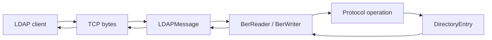
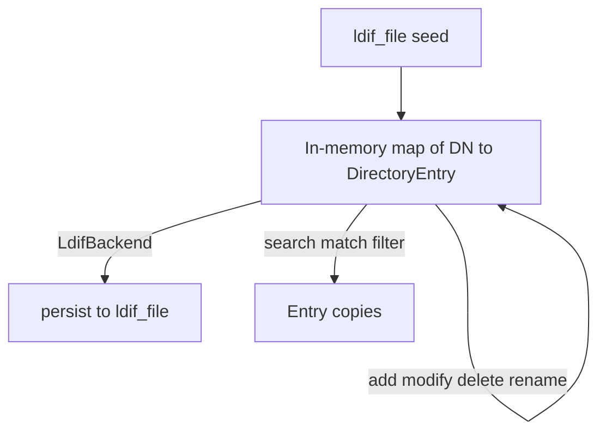
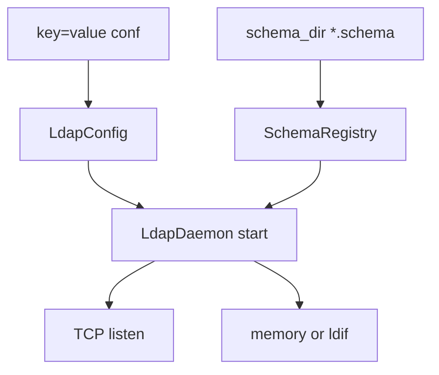

# Data flow

## On the wire

Messages are a BER `SEQUENCE` of message ID plus a context-specific operation tag (bind `0x60`, search request `0x63`, search entry `0x64`, and so on). Filters nest inside the search request: equality `0xA3`, substrings `0xA4`, present `0x87`, and/or/not `0xA0`/`0xA1`/`0xA2`.

`BerReader` holds a pointer to the caller's `std::vector<uint8_t>`. Keep that buffer alive for the lifetime of the reader.

## Directory storage

DNs are compared case-insensitively on attribute types. The memory backend scopes search with base / one / subtree. The LDIF backend uses the same in-memory tree and writes the whole tree back on successful writes.

## Config and schema at startup

Writes (add, modify, modrdn) fail with a schema result code when MUST/MAY/SYNTAX do not hold. Search does not re-validate existing entries.
