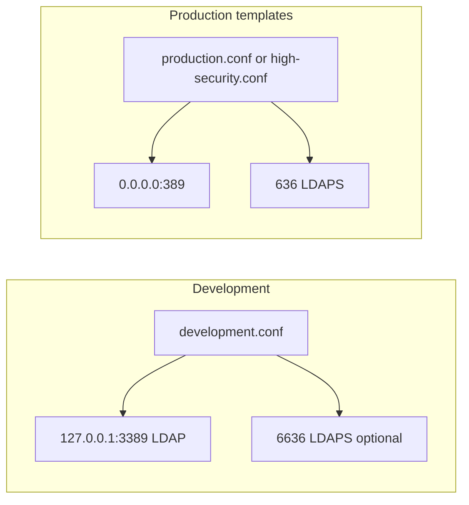
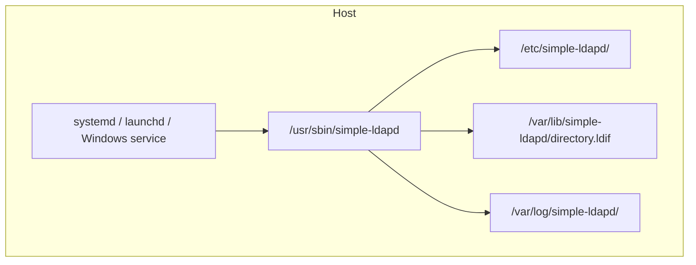

# Deployment views

## Lab vs production ports

Development binds unprivileged ports so the daemon can run without root. Production templates expect 389/636, TLS files under `/etc/simple-ldapd/tls/`, and an LDIF file under `/var/lib/simple-ldapd/`.

## Host layout

Unit files live in [deployment/](../../deployment/README.md):

- Linux: `deployment/systemd/simple-ldapd.service`
- macOS: `deployment/launchd/com.simpledaemons.simple-ldapd.plist`
- Windows: `deployment/windows/simple-ldapd.service.bat`
- Docker example: `deployment/examples/docker/`

`--daemon` does not fork. Use the OS supervisor (systemd, launchd, a Windows service, or a container entrypoint) and keep `foreground = true` or pass `--foreground`.
