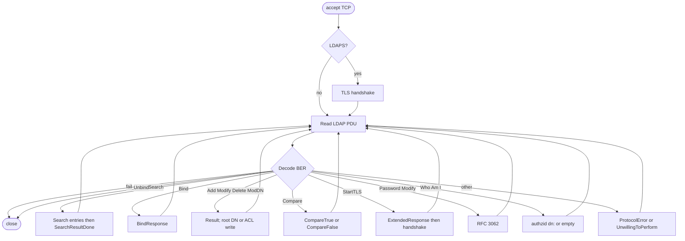
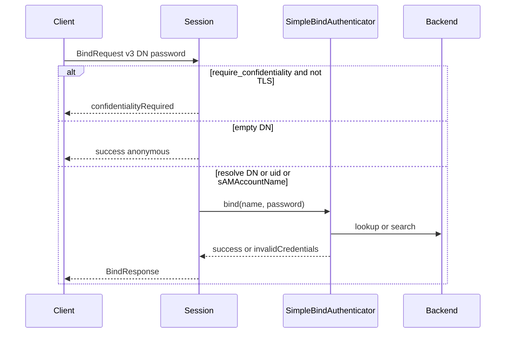
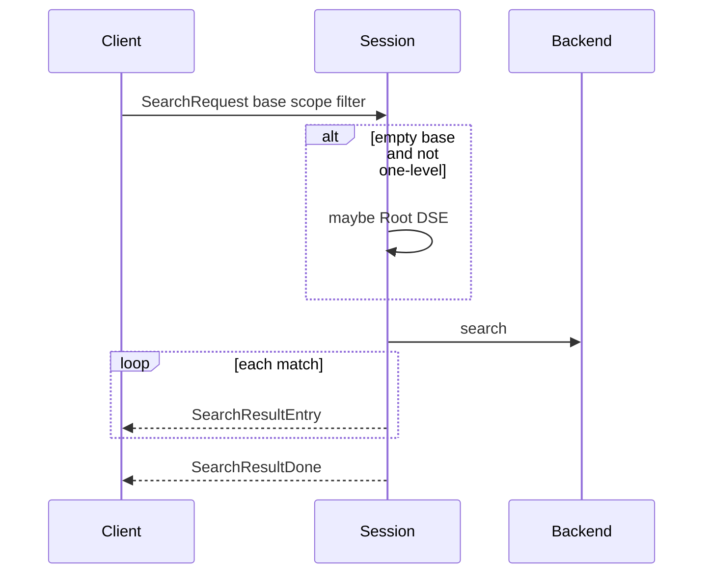
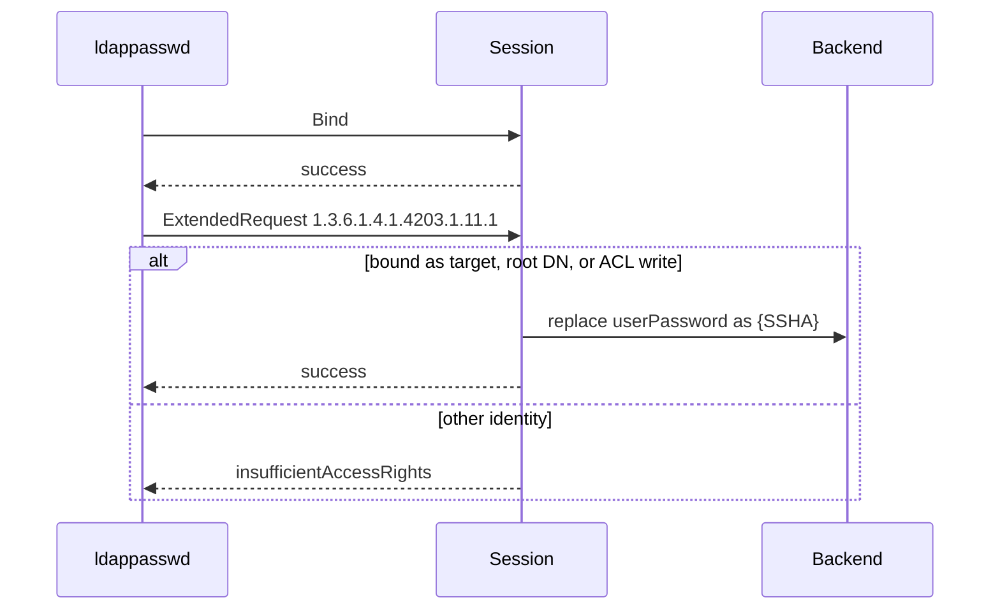

# Protocol flows

## Session loop

The accept loop starts a session thread per connection and keeps polling both listeners. `stop()` sets `running_` false and joins workers.

## Simple bind

Anonymous bind is an empty DN and empty password. A non-empty password with an empty DN is `invalidCredentials`. After a successful named bind, the session stores the **canonical** entry DN so self-service `ldappasswd` works even if the client bound as `uid=alice,dc=example,dc=com`.

## Search

`userPassword` is omitted unless the session is bound as the root DN.

## Password modify

`root_password` is config-only and cannot be changed with this operation.
