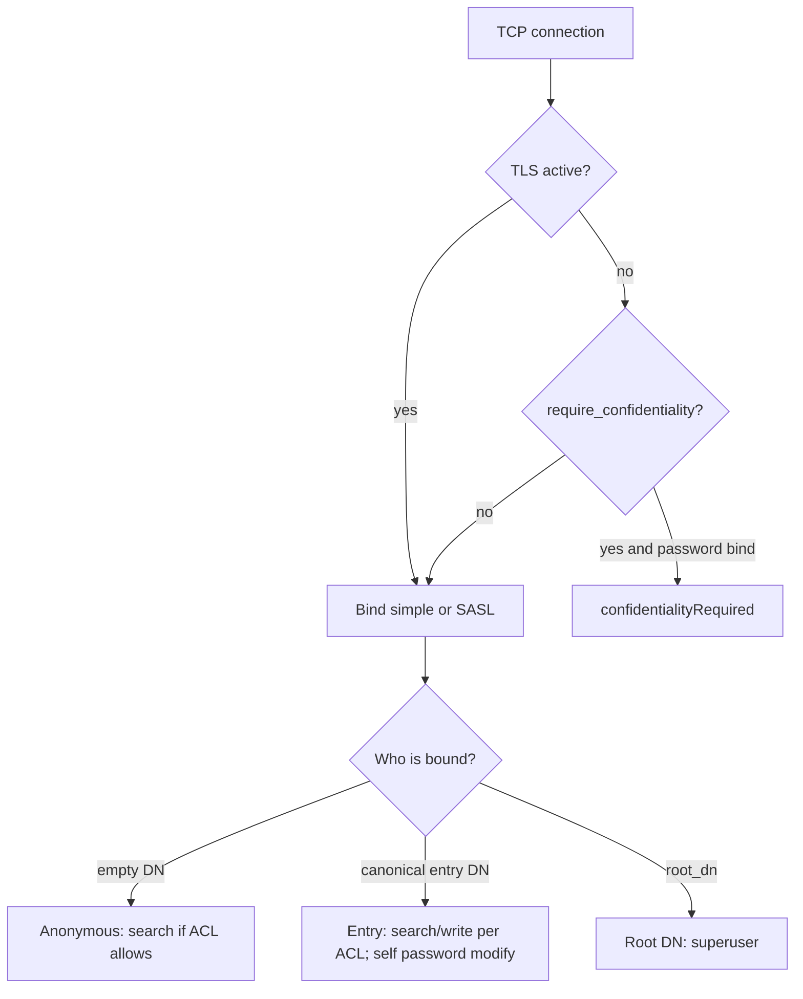

# Security model

## Authentication

| Method | Notes |
|--------|--------|
| Anonymous | Empty DN and empty password |
| Simple bind | Root DN + `root_password`, or entry `userPassword` (`{SSHA}` / `{SHA}` / `{CLEARTEXT}` / unprefixed) |
| Name resolution | Full DN, uid / sAMAccountName, or a DN whose RDN value matches that account |
| SASL PLAIN / DIGEST-MD5 | uid, sAMAccountName, or DN as authcid |
| SASL EXTERNAL | Authzid must match a verified TLS client certificate CN |
| SASL GSSAPI | HMAC lab tickets from `gssapi_keytab`, not MIT / RFC 4120 |

## Authorization

- With no `acl` lines: anyone may search; only `root_dn` may write
- With `acl` lines: unmatched search/write is denied (`anonymous` / `users` / `dn:` / `group:` on a subtree)
- `root_dn` is always superuser
- RFC 3062 password modify: self-change, root-set, or `acl` write on the target. `root_password` is not an entry attribute
- `userPassword` is stripped from search results unless the session is bound as the root DN

## TLS

- LDAPS: separate listener, handshake before LDAP.
- StartTLS: OID `1.3.6.1.4.1.1466.20037` on the LDAP port when `enable_starttls` is true.
- `require_confidentiality` refuses simple binds that send a password on cleartext.
