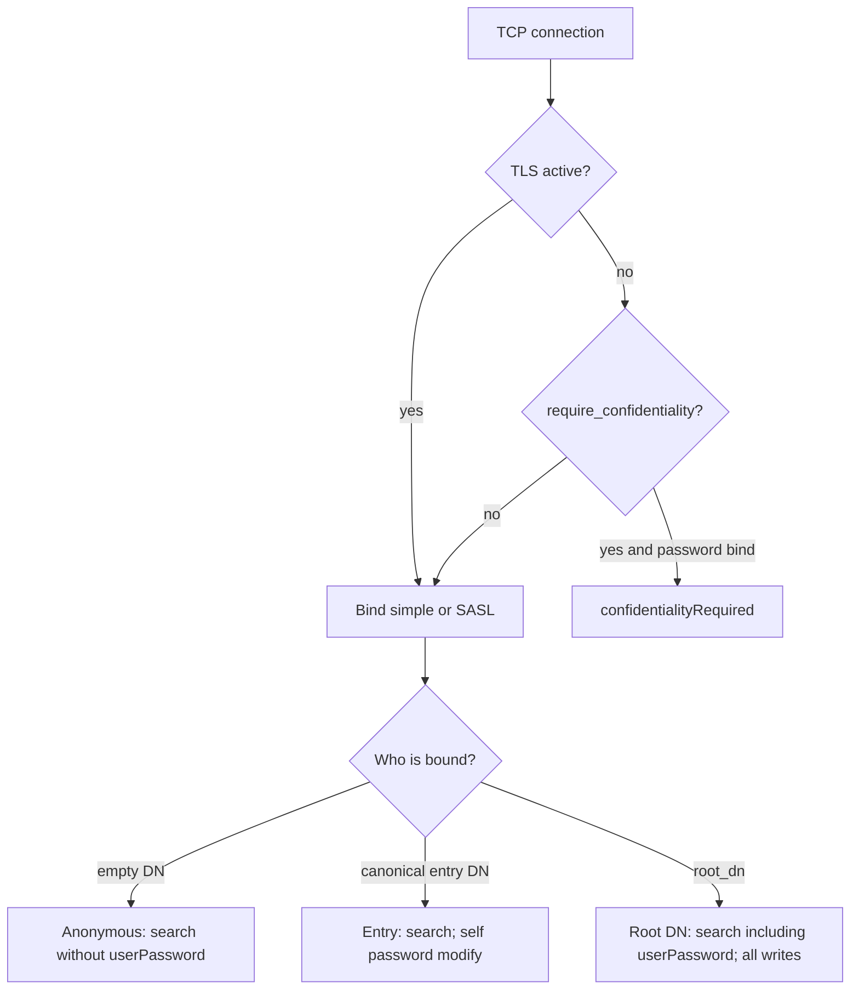

# Security model

## Authentication

| Method | Notes |
|--------|--------|
| Anonymous | Empty DN and empty password |
| Simple bind | Root DN + `root_password`, or entry `userPassword` (optional `{CLEARTEXT}` prefix) |
| Name resolution | Full DN, uid / sAMAccountName, or a DN whose RDN value matches that account |
| SASL PLAIN / DIGEST-MD5 | uid, sAMAccountName, or DN as authcid |
| SASL EXTERNAL | Authzid DN over TLS; the client certificate is not verified |
| SASL GSSAPI | HMAC lab tickets from `gssapi_keytab`, not MIT / RFC 4120 |

## Authorization

- Directory writes (add, modify, delete, modrdn) require a bind as `root_dn`.
- RFC 3062 password modify: the bound user may change their own `userPassword`; the root DN may set another entry's. `root_password` itself is not an entry attribute.
- `userPassword` is stripped from search results unless the session is bound as the root DN.

## TLS

- LDAPS: separate listener, handshake before LDAP.
- StartTLS: OID `1.3.6.1.4.1.1466.20037` on the LDAP port when `enable_starttls` is true.
- `require_confidentiality` refuses simple binds that send a password on cleartext.

There are no per-entry ACLs yet. Treat the root DN password as full directory control.
